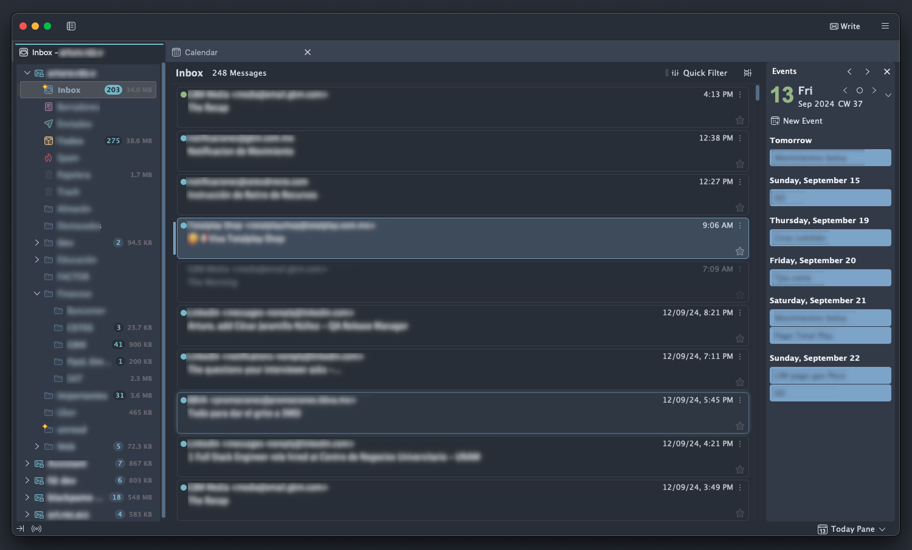
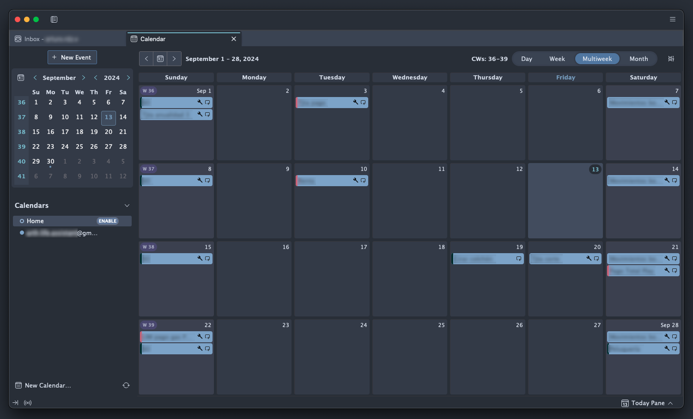
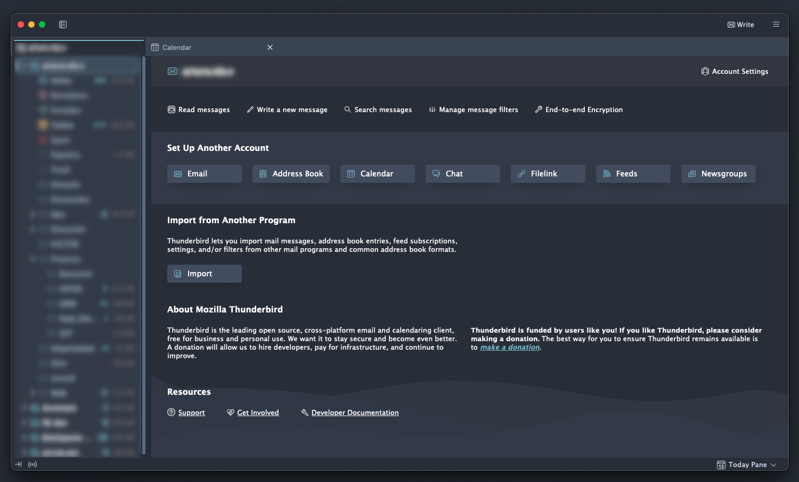
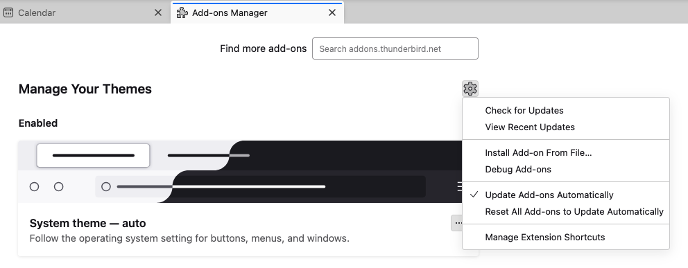

# Thunderbird Nord Hardt Theme

An arctic, north-bluish dark, clean and elegant color scheme for **Thunderbird 128+**. Based on the [Nord Theme](https://www.nordtheme.com) pallette.







Theme generated using the [Thunderbird Theme Builder](https://github.com/artrz/thunderbird-theme-builder).

## Install

 1. [Download the latest release](https://github.com/artrz/thunderbird-nord-hardt-theme/releases) or [build it yourself](#build).
 2. Install it by clicking the cog in the Themes configuration section and selecting 'Install Add-on From File...'.



## Build

Install the required dependencies:

```sh
npm install
```

Generate the theme:

```sh
npm run build
```

The XPI file will be created inside `./build`

## Release Notes

See the [changelog](./CHANGELOG.md).

## Contributing

First of, thanks for your interest in helping out!

There are a set of tool configured to ease development:
 - Git hooks configured via [Lefthook](https://lefthook.dev/)
 - Github PR title linted via [Commitlint](https://commitlint.js.org/)
 - Versioning managed via [cliff-jumper](https://github.com/favware/cliff-jumper)

Lefthook is configured to automatically perform tasks on pre-commit and pre-push hooks.
To install the git hooks in your cloned repo run `npm run prepare`.
This way, [the configured hooks](./lefthook.yml) will be automatically executed.

When creating a PR, the title will be automatically linted with a [github workflow](./.github/workflows/semantic-pull-request.yml)
to ensure it's conformant with the [conventional commit structure](https://www.conventionalcommits.org/en/v1.0.0/).
Failing to comply wont let the PR to merge. This is important because the versioning tool
uses the commit messages to define the version change.


## Versioning and releasing

Once you're in the main branch with all changes merged and ready to release a new version:

Use `npm run bump` to increment the version and update the changelog and commit the changes. Internally,
`bump` uses cliff-jumper to automatize the process.

To undo a bump, use `npm run debump [THE GENERATED TAG]` which undoes the commit and deletes the tag.

Finally, run `npm run publish` to push the changes along with the new tag.


## License

See the [license](./LICENSE.md).
